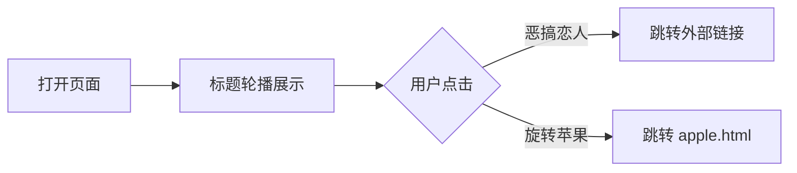

## 1. 产品概述

一个极简黑白灰配色的个人引导页，以大标题文字轮播为核心视觉焦点，搭配两个醒目的圆角方框按钮，引导访客跳转到不同的趣味页面。整体风格冷淡、克制、带有幽默感。

## 2. 核心特性

### 2.2 功能模块
1. **首页**：大标题轮播区域、跳转按钮区域

### 2.3 页面详情
| 页面名称 | 模块名称 | 功能描述 |
|---------|---------|---------|
| 首页 | 标题轮播区 | 页面加载后，大标题在两句文案间轮播切换 |
| 首页 | 按钮区 | 两个大尺寸圆角方框按钮，分别跳转至外部链接和本地页面 |

## 3. 核心流程

用户打开页面 → 看到居中偏上的大标题开始轮播切换 → 用户点击"恶搞恋人"按钮跳转至 `https://harbor-uyqf.upma.site/` → 或点击"旋转苹果"按钮跳转至同目录下的 `apple.html`

## 4. 用户界面设计

### 4.1 设计风格
- **配色**： strictly 黑白灰，不使用任何渐变色。背景 `#ffffff` 或 `#f5f5f5`，文字 `#000000` 或 `#333333`，按钮边框 `#000000`，按钮悬停 `#000000` 背景 + `#ffffff` 文字
- **按钮样式**：大尺寸圆角方框（border-radius: 12px 或 16px），黑色边框，白色底色，无阴影
- **字体**：使用系统默认无衬线字体栈，大标题使用极大字号（如 `clamp(2rem, 5vw, 4rem)`），粗体
- **布局**：单列居中布局，内容集中在页面中间偏上位置，上下留白充足
- **动效**：标题切换使用淡入淡出或上下滑动动画，周期约 3 秒；按钮悬停有颜色反转过渡

### 4.2 页面设计概览
| 页面名称 | 模块名称 | UI 元素 |
|---------|---------|---------|
| 首页 | 标题轮播区 | 居中大标题，黑白配色，fade/slide 切换动画 |
| 首页 | 按钮区 | 两个大圆角方框按钮，横向或纵向排列，间距充足 |

### 4.3 响应式设计
- 桌面端：按钮横向排列，标题字号最大
- 移动端：按钮纵向排列，标题适配屏幕宽度，内边距适当减小
