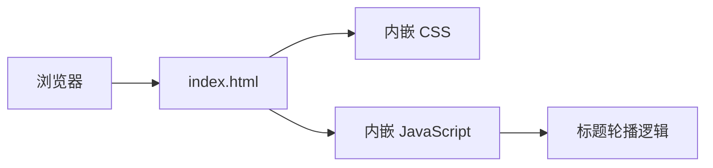

## 1. 架构设计

## 2. 技术描述

- **前端**：纯 HTML5 + CSS3 + 原生 JavaScript，无框架
- **构建工具**：无，直接以静态文件形式部署
- **后端**：无
- **数据**：无

## 3. 路由定义

| 路由 | 用途 |
|-----|------|
| `/index.html` | 个人引导页主页 |
| `/apple.html` | 旋转苹果项目页面（已存在） |

## 4. 实现要点

- **标题轮播**：使用 `setInterval` 每 3 秒切换一次文案，配合 CSS `opacity` 或 `transform` 过渡实现平滑动画
- **按钮样式**：纯 CSS 实现，黑色边框，圆角，悬停时背景色与文字色反转过渡
- **布局**：Flexbox 垂直水平居中，内容整体偏上（非完全居中， slightly towards top）
- **响应式**：使用 `clamp()` 和媒体查询适配不同屏幕
